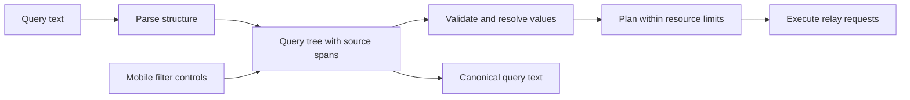

# Query parser options for ants

Research date: 3 October 2026. Updated 4 October 2026 after reviewing ants-android. This is a design recommendation, not a description of implemented syntax.

**Updated recommendation: prototype an action-free ANTLR grammar with Java output for the existing Kotlin Android app and TypeScript output for the web app.** Compare it with small handwritten recursive-descent parsers sharing one specification and conformance corpus. Peggy remains attractive for the web alone, but it cannot generate the native JVM parser the existing Android application needs.

The essential change is architectural: parsing, meaning, and execution need separate stages. Changing libraries while retaining global token extraction and string expansion would preserve the most serious problems.

## Evidence from ants

Reviewed against [master at 391b30c](https://github.com/dergigi/ants/tree/391b30c373a2efccab4ceee3a7ae879d4a689ffa). The earlier [syntax reference in PR 310](https://github.com/dergigi/ants/pull/310) describes an older baseline; master has since restored contacts modifiers. The core parsing functions examined here are unchanged between those baselines.

I executed the existing helpers locally, with no relay traffic. These are helper-level observations, not claims about every complete search path:

| Input | Observed helper behavior | Design problem |
| --- | --- | --- |
| `"(cats OR dogs)"` | `expandParenthesizedOr` produces `"cats"` and `"dogs"` | Parentheses inside a quoted literal are treated as syntax. |
| `a OR (b OR c)` | `parseOrQuery` produces `a`, `(b`, `c)` | The splitter does not track nesting. Other stages may mask this for particular inputs. |
| `kind:1 by:alice OR kind:30023 by:bob` | `parseSearchQuery` returns one shared `effectiveKinds: [1, 30023]` | The representation loses the association between each author and kind. |
| `since:2024-01-01 bitcoin OR since:2025-01-01 nostr` | One shared `since: 1735689600` remains | The later date replaces the earlier branch's date. |
| Twelve independent `(aN OR bN)` groups | 135 input characters produce 4,096 expanded strings | Syntax rewriting materializes a Cartesian product before execution planning. |

Four groups produced 16 strings; eight produced 256. These are measured expansion counts, not measured subscription counts or parser-speed benchmarks. Some execution paths optimize particular searches, so relay traffic cannot be inferred directly from the count.

The causes are visible in [queryTransforms.ts](https://github.com/dergigi/ants/blob/391b30c373a2efccab4ceee3a7ae879d4a689ffa/src/lib/search/queryTransforms.ts), [queryParsing.ts](https://github.com/dergigi/ants/blob/391b30c373a2efccab4ceee3a7ae879d4a689ffa/src/lib/search/queryParsing.ts), and their ordering in [search.ts](https://github.com/dergigi/ants/blob/391b30c373a2efccab4ceee3a7ae879d4a689ffa/src/lib/search.ts). Quotes, groups, and filters are handled by different string operations. Quote toggling also has no escaped-quote state. The [OR handler](https://github.com/dergigi/ants/blob/391b30c373a2efccab4ceee3a7ae879d4a689ffa/src/lib/search/orQueryHandler.ts) then turns expanded strings into search work.

## Evidence from the existing Android app

The mobile application already exists in native Kotlin and Jetpack Compose. Reviewed [ants-android at f38d463](https://github.com/dergigi/ants-android/tree/f38d463ecdc44653b2714884fce5a37a4dd1fbe8) through source inspection, without modifying, building, or running it.

[SearchQuery.kt](https://github.com/dergigi/ants-android/blob/f38d463ecdc44653b2714884fce5a37a4dd1fbe8/app/src/main/java/org/dergigi/ants/SearchQuery.kt) already splits top-level OR before extracting branch filters. Each `SearchBranch` has its own filter, so the web's global kind/date extraction problem is not the same on Android. It enforces a 2,000-character query limit and at most eight OR branches, validates kind numbers and date ordering, and explicitly rejects grouping. Its parentheses check also rejects parentheses inside quoted text, except for the earlier standalone-URL path. Tokenization and quote counting do not implement escaped quotes. These are source observations, not executed Android test results.

[RelaySearch.kt](https://github.com/dergigi/ants-android/blob/f38d463ecdc44653b2714884fce5a37a4dd1fbe8/app/src/main/java/org/dergigi/ants/RelaySearch.kt) places branch filters in one `REQ` per relay route. It checks structured and local branch predicates, verifies signatures, and deduplicates events by ID. It also bounds retained results and memory and closes work on timeout or cancellation. [OutboxRouter.kt](https://github.com/dergigi/ants-android/blob/f38d463ecdc44653b2714884fce5a37a4dd1fbe8/app/src/main/java/org/dergigi/ants/OutboxRouter.kt) directs branches with search text to configured search relays and routes structured branches separately.

This confirms the intended execution model: one logical search filter per branch, followed by union and deduplication. Separate logical branches need not mean separate subscriptions or sockets. Preserve that batching when introducing nesting, except where branch-specific local predicates require keeping track of which branch returned an event. Currently `SearchBranch.accepts` does not check the `search` text, and a multi-filter subscription does not identify the matching filter. Mixed text/local-predicate branches therefore need an explicit attribution policy; this is an execution concern independent of grammar choice.

The migration should preserve Android's existing branch model and resource limits. Insert a syntax tree before `SearchBranch` compilation; move asynchronous profile resolution out of syntax recognition. [QueryTranslation.kt](https://github.com/dergigi/ants-android/blob/f38d463ecdc44653b2714884fce5a37a4dd1fbe8/app/src/main/java/org/dergigi/ants/QueryTranslation.kt) separately tokenizes previews, so include it when replacing syntax logic. Share semantic fixtures for dates and aliases as well as grammar fixtures: grammar generation alone cannot prevent those behaviors from drifting.

## The five options

The updated ranking is my assessment for the existing TypeScript web and Kotlin Android applications and a reviewable shared syntax specification. It is not a ranking from comparative performance measurements. All five can represent nested expressions; all still need semantic validation and execution limits.

| Rank | Approach | Best reason to choose it | Main cost | Mobile implication |
| --- | --- | --- | --- | --- |
| 1 | ANTLR | One grammar generating TypeScript and Java parsers | Generator, runtimes, and cross-target semantic adapters | Kotlin consumes the generated Java parser |
| 2 | Handwritten tokenizer and recursive descent | Small implementations with direct control | Two implementations must pass the same conformance corpus | Native Kotlin and TypeScript implementations |
| 3 | Peggy | A concise grammar for the web parser | Does not generate JVM code; Android needs another implementation or a JS engine | Less suitable as the shared foundation |
| 4 | Chevrotain | Structured TypeScript/JavaScript tooling and error recovery | No JVM generation; completion requires separate work | Android still needs a separate parser |
| 5 | Lezer | Incremental parsing and editor feedback | Editor-oriented integration and no JVM generation | Primarily a web editor option |

### 1 ANTLR

ANTLR generates parsers and tree visitors/listeners from a grammar. Official targets include JavaScript, TypeScript, Swift, Dart, and Java. Kotlin is not an official target in that list; Android can consume Java-generated code. The generator uses Java, while deployed parsers use their target runtime. Target features are not always introduced simultaneously. [ANTLR project](https://github.com/antlr/antlr4), [target documentation](https://github.com/antlr/antlr4/blob/dev/doc/targets.md)

**Why first after inspecting Android:** Java output is directly usable from Kotlin, and TypeScript output serves the web. Keep the grammar free of target-specific semantic actions; implement adapters from each parse tree to the same versioned query model. Share fixtures for parsing, diagnostics, dates, aliases, and compiled branch filters. This provides one syntax definition while allowing each application to retain its existing execution code.

**Tradeoff:** tool/runtime coordination, generated code, and two semantic adapters are real costs. A prototype must demonstrate acceptable Android initialization, APK impact, diagnostics, and equivalent output before adoption. The recommendation is based on the actual language targets, not an unmeasured performance claim.

### 2 Handwritten tokenizer and recursive descent

A tokenizer would recognize complete quoted strings, parentheses, operators, and field tokens with source spans. A small set of parsing functions would implement precedence and return a tree. Recursive descent maps grammar rules to functions and handles groups by recursively parsing an expression. For this small operator set, a Pratt parser is optional, not necessary. [Recursive-descent explanation](https://craftinginterpreters.com/parsing-expressions.html), [Pratt parsing explanation](https://craftinginterpreters.com/compiling-expressions.html)

**Why second:** ants' language can remain deliberately small. An explicit scanner and predictive parser offer direct control over errors and require no third-party parsing runtime. This is a complete replacement for structural regex rewriting, not another layer of regex patches.

**Tradeoff:** ants must maintain escape handling, synchronization, precedence, and diagnostics in both Kotlin and TypeScript. The grammar in the documentation can drift from the implementation unless examples and generated cases exercise both.

A predictive implementation can aim for linear scanning and parsing of this grammar, but bounded input and nesting remain necessary. Any claim that it is faster or smaller than a generated alternative needs measurement on the same language and inputs.

### 3 Peggy

Peggy generates a JavaScript parser from a PEG grammar. It supports actions that construct a query tree, source locations, syntax errors, and generated TypeScript declarations. Generate the parser at build time; the generated parser does not require the Peggy runtime. Its ordered alternatives mean grammar order must be intentional. Caching is off by default; its documented cache option trades overhead for protection against pathological repeated parsing. [Peggy documentation](https://peggyjs.org/documentation.html)

For ants, I would put precedence, grouping, phrases, escapes, and recognized field syntax in one grammar. Keep date interpretation, identifier resolution, alias definitions, and Nostr planning outside grammar actions. This makes the grammar reviewable without embedding the whole application in it.

**Why third after inspecting Android:** the user's requirement includes reviewing and documenting the language. A grammar file gives that review a concrete implementation counterpart. My expected benefit is fewer scattered parsing rules, not an unmeasured speed advantage.

**Tradeoff:** friendly suggestions and partial-input handling still require application code. It does not generate JVM code. Adding a JavaScript engine to the native Android app solely for parsing needs a stronger justification than this report establishes.

### 4 Chevrotain

Chevrotain defines grammars through a JavaScript DSL without a code-generation step. Its concrete syntax trees and visitors support a separate semantic layer. It also supplies recovery mechanisms such as token insertion, deletion, and resynchronization. These are useful for displaying errors while someone types. [Project documentation](https://chevrotain.io/docs/), [concrete syntax trees](https://chevrotain.io/docs/guide/concrete_syntax_tree.html), [error recovery](https://chevrotain.io/docs/tutorial/step4_fault_tolerance.html)

**Why fourth:** a good choice if the team prefers TypeScript tooling and detailed diagnostics over a separate grammar format. Recovering enough structure to underline an unfinished group can improve web input, but the native Android app needs equivalent support separately.

**Current-version caveat:** version 12 removed `computeContentAssist` and `getNextPossibleTokenTypes`; older articles still advertise these APIs. Version 12 also raised the Node requirement to 22. Do not select it assuming current built-in autocomplete. [Breaking changes](https://chevrotain.io/docs/changes/BREAKING_CHANGES)

**Tradeoff:** more machinery than the simplest handwritten parser, without solving JVM parser generation. Keep recovery for editing; reject errors on submission so a repaired tree cannot silently drop an author restriction. Reuse parser initialization where appropriate and benchmark cold startup as well as repeated parsing.

### 5 Lezer

Lezer is designed for editor parsing. It generates JavaScript parse tables, supports incremental reuse, and produces compact concrete syntax trees. It normally recovers from incomplete or invalid input, marking errors; a strict mode also exists. [Lezer guide](https://lezer.codemirror.net/docs/guide/), [API reference](https://lezer.codemirror.net/docs/ref/)

**Why fifth:** strong if ants evolves into an interactive query editor with syntax highlighting, cursor-aware feedback, and substantial expressions. For a short search field, the integration work is harder to justify solely for nested parentheses.

**Tradeoff:** the editor tree still needs conversion into a stable semantic query tree. A recovered tree is useful feedback, but it is not permission to execute a query. If used only for presentation beside another parser, a shared conformance corpus must prevent their language definitions from diverging.

I would raise its rank only after deciding that editor features are central to the product. Incremental parsing should be measured against typical query lengths rather than assumed to improve perceived speed.

## The architecture every option needs



The query tree, also called an abstract syntax tree or AST, records relationships without expanding every possible combination. Represent `And`, `Or`, `Field`, `Text`, and `Phrase` explicitly. Keep source spans for diagnostics and retain the original text for editing. UI-created queries can construct the same model directly, with schema validation at that boundary.

Expand aliases into tree nodes only after recognizing syntax. For example, a media alias can become a group of alternatives without rewriting quoted text. Resolve authors asynchronously after parsing, with cancellation, bounded concurrency, and caching. Specify whether relative dates are evaluated when a saved query is opened or executed, and use one clock snapshot per execution.

Preserve branch scope. The proposed meaning of:

```text
(by:alice kind:1) OR (by:bob kind:30023)
```

is two correlated branches. It must not become a single filter with both authors and both kinds, because that also admits Alice's articles and Bob's notes. Conversely, independently selected authors and independently selected kinds can sometimes be combined into arrays in one filter. The planner must establish equivalence before applying that optimization.

Keep syntax size separate from plan size. An AND of twelve OR groups has a compact tree even if a particular execution strategy would require thousands of alternatives. Estimate and limit expansion before allocating it. Limit input size, nesting, AST size, planned filters, active subscriptions, result accumulation, and execution duration; return a useful complexity error when limits are exceeded. A depth limit alone would not stop the twelve shallow groups reproduced above.

### Nostr limits the semantics we can promise

NIP-01 combines fields within a filter with AND, list values with OR, and multiple filters with OR. NIP-50 leaves text-search behavior to relay implementations and tells relays to ignore unsupported extensions. Neither specifies a portable, general Boolean full-text language. [NIP-01](https://github.com/nostr-protocol/nips/blob/master/01.md), [NIP-50](https://github.com/nostr-protocol/nips/blob/master/50.md)

OR should be implemented as branch filters with union and deduplication, as Android already does. The narrower limitation is that a correct parser cannot guarantee exact phrase, conjunction, or negation semantics inside each branch across arbitrary relays. Intersecting two independently limited result sets can miss genuine matches. Negation needs a defined candidate universe or a backend that supports the operation. These are deductions from the protocol constraints, not parser-library limitations.

The planner should distinguish exact structured filters, relay-dependent text search, and unsupported operations. Document that distinction in the user guide. Do not silently broaden a request when a branch cannot be implemented, and defer general `NOT` until its execution semantics are defined.

## Proposed syntax decisions to review

These are proposed rules for a future version, not claims about today's implementation:

| Topic | Proposed rule |
| --- | --- |
| Precedence | Parentheses first; conjunction before `OR`. Specify implicit conjunction separately from relay full-text behavior. |
| Group scope | Every field stays in its enclosing branch. `(a OR b) kind:1` applies the kind to both alternatives. |
| Scoped values | Consider `by:(alice OR bob)` as shorthand for `(by:alice OR by:bob)`, with allowed value types defined per field. |
| Quotes | Double quotes protect operators, parentheses, and field-looking text; define `\"` and `\\` escaping explicitly. Phrase matching remains subject to backend capability. |
| Operators | Recognize whole operator tokens, not substrings inside words or URLs. Preserve existing case-insensitive `OR` unless intentionally migrated. |
| Colon tokens | Use a field registry. Keep ordinary URLs and unknown colon-containing text literal; show a suggestion for likely misspelled fields. Never silently discard them. |
| Repeated fields | Define per-field meaning. Prefer explicit OR or comma lists for alternatives; diagnose contradictory scalar constraints. |
| Invalid input | While typing, show local feedback. On submit, reject incomplete groups, missing operands, invalid field values, and unsupported plans. |
| Dates | Validate actual calendar dates, timezone, boundaries, and relative-month behavior rather than accepting rollover. |

For mobile, define a versioned query model and a canonical printer now. Text input and filter chips should round-trip through the same semantics. Preserve human-readable labels separately from resolved identifiers. Standardize source-offset units across runtimes so emoji do not move an error underline. Keep network operations out of parsing so editing works offline.

## Migration and performance validation

1. Establish a conformance corpus from documented examples, existing tests, saved-query formats, and the failures above. Separate compatibility cases from deliberate semantic changes; do not make every existing bug a requirement.
2. Prototype ANTLR with Java and TypeScript targets against the same query model. Compare it with small handwritten Kotlin and TypeScript parsers using identical fixtures and branch outputs.
3. Compare cold initialization, warm parse latency, memory, generated/bundled bytes, malformed-input behavior, and deeply nested input. Measure execution planning separately, including many shallow OR groups and aliases. Measure generated Java on representative Android devices and TypeScript output in target browsers before drawing performance conclusions.
4. Add generated tests for normalized parse/print/parse equivalence, escaped quotes, Unicode, parentheses, alias expansion, and bounded rejection. Property-based tools can generate cases and shrink failures. [fast-check introduction](https://fast-check.dev/docs/introduction/)
5. Test planner equivalence over a finite fixture event set, especially correlated branches, contradictory dates, deduplication, and filter-array optimizations. Verify cancellation and concurrency limits using fake relays.
6. Compare old and new parse/planning results behind a flag without sending duplicate relay searches. Migrate shared URLs and saved queries deliberately, then remove the old structural rewriting paths. Keep examples executable in CI and publish the syntax guide beside the grammar.

No five-way runtime benchmark was performed for this report. The recommendation rests on source inspection, executed failure probes, official library documentation, and protocol constraints. Remaining decisions are the shared parser approach, exact text-matching promises within branches, nesting and expansion budgets beyond Android's existing limits, and whether a rich editor is worth its integration cost.

## Reproduce the local probes

From the repository root with its TypeScript dependency installed, this runs the existing source through TypeScript's CommonJS transpiler. It does not contact relays:

```sh
node <<'JS'
const ts = require('typescript');
const fs = require('fs');
require.extensions['.ts'] = (m, f) => m._compile(
  ts.transpileModule(fs.readFileSync(f, 'utf8'), {
    compilerOptions: { module: ts.ModuleKind.CommonJS }
  }).outputText, f
);
const t = require('./src/lib/search/queryTransforms.ts');
const p = require('./src/lib/search/queryParsing.ts');
for (const q of ['"(cats OR dogs)"', 'a OR (b OR c)']) {
  console.log({ q, split: t.parseOrQuery(q), expanded: t.expandParenthesizedOr(q) });
}
for (const q of [
  'kind:1 by:alice OR kind:30023 by:bob',
  'since:2024-01-01 bitcoin OR since:2025-01-01 nostr'
]) console.log({ q, parsed: p.parseSearchQuery(q, [1]) });
for (const n of [4, 8, 12]) {
  const q = Array.from({ length: n }, (_, i) => `(a${i} OR b${i})`).join(' ');
  console.log({ groups: n, characters: q.length, expanded: t.expandParenthesizedOr(q).length });
}
JS
```
